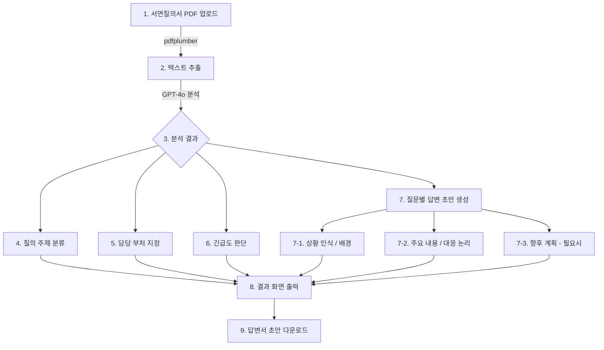

# 국회 서면질의 답변서 AI 초안 생성 시스템

## 기획 배경
국회의원이 제출한 서면질의서를 수동으로 검토하고 답변서를 작성하는 과정은 많은 시간과 인력이 소요됩니다.
AI를 활용하여 질의서를 자동으로 분류하고 답변 초안을 생성함으로써 업무 효율화를 도모합니다.

## 주요 기능
- 서면질의서 PDF 업로드 및 텍스트 자동 추출
- GPT-4o 기반 질의 주제 자동 분류
- 담당 부처 자동 지정 및 관련 부처 파악
- 긴급도 자동 판단 (높음/보통/낮음)
- 질문별 답변 초안 자동 생성
  - 상황 인식 / 배경
  - 개선 방향 / 주요 내용 / 대응 논리
  - 향후 계획 / 강조 사항 (필요시)
- 답변서 초안 텍스트 파일 다운로드

## 기술 스택
- Python / Streamlit
- OpenAI GPT-4o
- pdfplumber (PDF 텍스트 추출)
- python-dotenv

## 다이어그램



## 실행 방법

**uv 사용 시 (권장)**
```bash
uv sync
uv run streamlit run main.py
```

**pip 사용 시**
```bash
pip install -r requirements.txt
streamlit run main.py
```

## 환경변수
`.env` 파일을 생성하고 아래 값을 입력하세요:
- `OPENAI_API_KEY`: [OpenAI Platform](https://platform.openai.com)에서 발급
- `ASSEMBLY_API_KEY`: [열린국회정보](https://open.assembly.go.kr)에서 발급